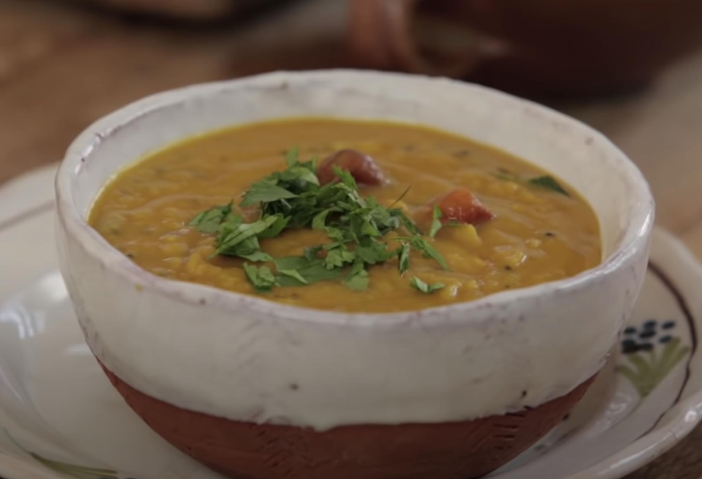

# Sweet and Sour Dal
## Image 

## Description

Boiled potatoes

## Ingredients

| Ingredient | Measurement | Unit | Notes |
| --- | --- | --- | --- |
| Red Lentils | 125 | g | washed |
| Water | 600 | ml | |
| Mustard Seeds | 1 | tsp | |
| Cumin | 1 | tsp |  |
| Madras Curry Powder | 2 | tsp |
| Curry Leaves | 10 | leaves | |
| Brown Sugar | 2 | tbsp | |
| Coriander | 1 | to taste |
| Sesame Seeds | 2 | tsp | 

## Method

1. Boil water and lentils for 50 minutes. Mash to thicken.
2. Toast mustard seeds and curry leaves in oil for 2 minutes.
3. Add sugar and rest of spices, put hob on high heat.
4. Add lentils, stir and bring to the boil.
5. Simmer for 10 minutes.

## Source
http://www.maunikagowardhan.co.uk/cook-in-a-curry/khatti-meethi-dal-sweet-sour-lentil-for-jamie-olivers-food-tube/

## Tags
vegan
vegetarian
asian
indian
protein